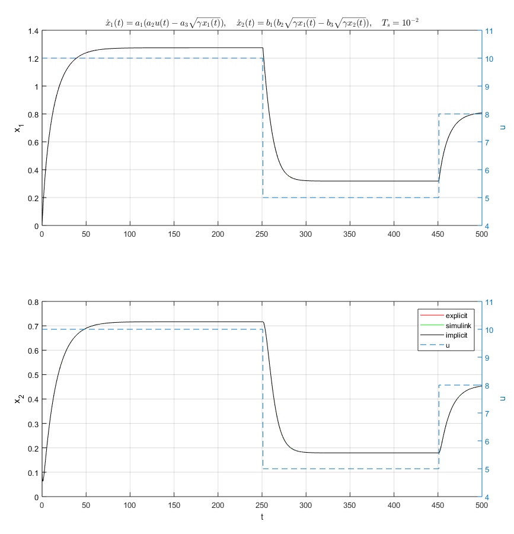

# libeuler - Explicit or Implicit Euler integration step

The library implements an integration step for an Euler integrator, with Tustin coefficient.

If the Tustin coefficient is null, the next step is evaluated as:

if the Tustin is different than zero, the next step is the solution of the following system
of equation:

The solution is found by using the Newton algorithm, a multistep method in which
the solution is iteratively found as solution of:

where the Jacobian is defined as:

## Dependencies

 * Lapack (in particular Lapacke)
 * Cblas

The two dependencies are available in Linux as packages in all major distribution. The two
dependencies are also distributed with MATLAB. To see how to compile a model with this integrator
check the Makefile

## Usage Example

Let's make an usage example and a comparison with the output of the equivalent Simulink model. 
The ODE to be solved is:

and it has the following Jacobian:

 * the implicit implementation is in `test/test_euleri.c`
 * the explicit implementation is in `test/test_eulere.c`

Those two immages summarizes the results:

 

 

